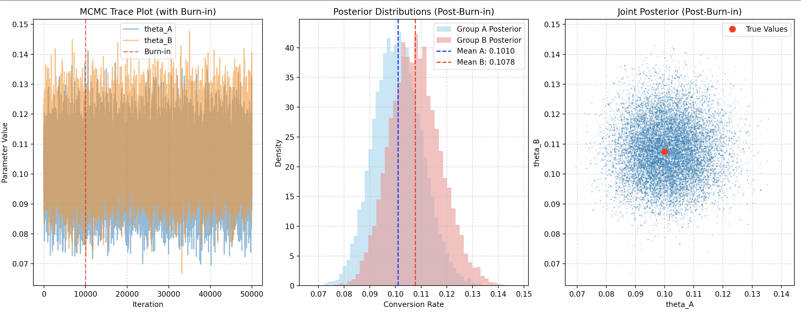

# Frequentist vs. Bayesian A/B Testing

This project provides a comprehensive comparison of two major statistical paradigms—Frequentist and Bayesian—applied to a common business problem: A/B testing. The primary goal is to not only demonstrate how each approach works but also to provide a hands-on implementation of the Metropolis-Hastings algorithm from scratch to shed light on how modern Bayesian inference is performed.

The script simulates an A/B test and analyzes the data using both a classical Z-test and a custom-built Markov Chain Monte Carlo (MCMC) sampler. This side-by-side comparison reveals the key differences in their philosophical underpinnings, methodologies, and the way they interpret results.

## Table of Contents

- [Dependencies](#dependencies)
- [Simulated A/B Test Data](#simulated-ab-test-data)
- [Frequentist Approach: The Z-Test](#frequentist-approach-the-z-test)
- [Bayesian Approach: MCMC and Metropolis-Hastings](#bayesian-approach-mcmc-and-metropolis-hastings)
- [Key Results and Comparison](#key-results-and-comparison)
- [Acknowledgments](#acknowledgments)

## Dependencies

To run this script, you need to have the following Python libraries installed:

- numpy
- matplotlib
- scipy
- statsmodels

You can install them using pip:

```bash
pip install numpy matplotlib scipy statsmodels
```

## Simulated A/B Test Data

For a fair comparison, both the frequentist and Bayesian methods analyze the exact same dataset, which is generated synthetically at the beginning of the script. This allows us to know the true conversion rates and assess how well each method estimates them.

In this simulation:

- **True Conversion Rate A**: 10.00%
- **True Conversion Rate B**: 10.75%
- **Visitors per Group**: 1,000

The simulated data observed by both tests is:

- **Group A**: 100 conversions out of 1,000 visitors (Observed Rate: 10.00%)
- **Group B**: 107 conversions out of 1,000 visitors (Observed Rate: 10.70%)

The observed data shows that Group B had a slightly higher conversion rate, but the question is whether this difference is statistically significant or merely due to random chance.

## Frequentist Approach: The Z-Test

The frequentist approach answers the question, "Assuming there's no difference between Group B and Group A (the null hypothesis), what's the probability of observing our data or something more extreme?"

This script performs a one-sided Z-test for proportions with a significance level (α) of 0.05.

### Methodology

- **Null Hypothesis (H₀)**: The conversion rate of B is equal to A (rate_B − rate_A = 0).
- **Alternative Hypothesis (H₁)**: The conversion rate of B is better than A (rate_B − rate_A > 0).

The Z-test calculates a Z-statistic and a corresponding p-value, which represents the probability of observing the data if H₀ were true.

**Decision Rule**: If the p-value is less than α, we reject the null hypothesis.

### Results

- **Z-statistic**: 0.5139
- **P-value**: 0.3037
- **Decision**: Fail to reject the null hypothesis.

**Conclusion**: Based on the frequentist test, there is no statistically significant evidence that Group B's conversion rate is higher than Group A's. The observed difference of 0.70% is considered likely to have occurred by chance.

## Bayesian Approach: MCMC and Metropolis-Hastings

The Bayesian approach answers a more direct question, "Given the data we've observed, what's the probability that Group B's conversion rate is actually higher than A's?"

This script uses a Metropolis-Hastings MCMC sampler to approximate the posterior distribution of the conversion rates for both groups. This posterior distribution represents our updated belief about the conversion rates after seeing the data.

### Key Concepts

- **Posterior Distribution**: Our belief about the parameters (conversion rates) after observing the data. It is proportional to the Likelihood (how well the parameters explain the data) times the Prior (our initial belief about the parameters).
- **Metropolis-Hastings**: An algorithm that creates a Markov Chain of samples that eventually converges to our posterior distribution. It proposes new parameter values and accepts or rejects them probabilistically based on how likely they are under the posterior.
- **MCMC Diagnostics**: We check for convergence using a trace plot and an acceptance rate (ideally between 20-50%). The first portion of samples, known as the burn-in period, is discarded to ensure the samples are from the converged distribution.

### Results

- **Posterior Mean (Group A)**: 10.10%
- **Posterior Mean (Group B)**: 10.78%
- **95% Credible Interval (Group A)**: (8.33%, 12.00%)
- **95% Credible Interval (Group B)**: (8.96%, 12.81%)
- **Probability that B > A**: 68.95%



**Conclusion**: The Bayesian analysis concludes that there is a 68.95% probability that Group B has a higher true conversion rate than Group A. This provides a more nuanced and intuitive result than the binary "reject/fail to reject" conclusion of the frequentist test. The results also show that our posterior means are very close to the true simulated rates, indicating that our custom Metropolis-Hastings sampler is working correctly.

## Key Results and Comparison

| Feature | Frequentist Approach | Bayesian Approach |
|---------|---------------------|------------------|
| **Core Question** | What's the probability of seeing this data given the null hypothesis? | What's the probability of B being better than A, given our data? |
| **Output** | p-value and a binary decision (Reject/Fail to Reject H₀) | Posterior probability, credible intervals, and distributions |
| **Decision** | Fail to reject H₀ (No statistically significant evidence) | There is a 68.95% probability that B is better than A |
| **Interpretation** | The data is not rare enough to disprove the null hypothesis | Our updated belief, after seeing the data, is that B is likely better than A, but there's still a significant chance it isn't |
| **Parameters** | Assumed to be fixed, but unknown | Treated as random variables with probability distributions |

## Acknowledgments

The core of my learnings about the Metropolis-Hastings Algorithm stem from this paper:

Chib, Siddhartha, and Edward Greenberg.  
“Understanding the Metropolis-Hastings Algorithm.”  
_The American Statistician_, vol. 49, no. 4, 1995, pp. 327–335.  
[https://doi.org/10.1080/00031305.1995.10476177](https://doi.org/10.1080/00031305.1995.10476177)

---
